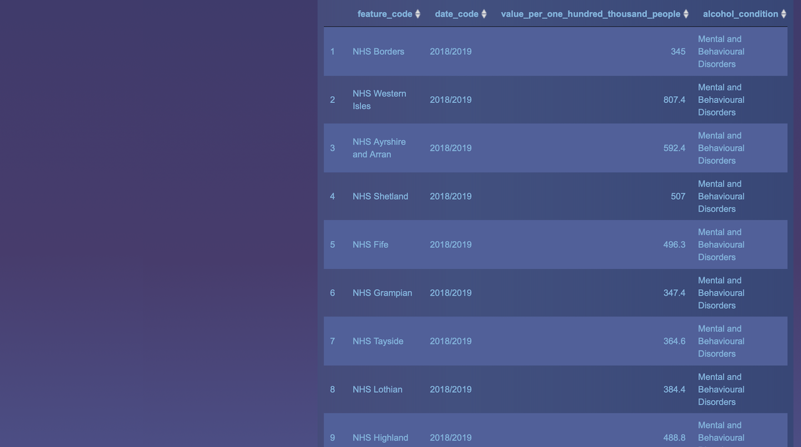

# Dashboard Group Project

## Introduction
As part of Data Analysis course, we had to create a dashboard using RStudio and Shiny about Scotland's overall health state and particular health problem and how it changed over the last 5 - 10 years.

The user can explore and visualise the annual number of inpatient stays in hospitals in Scotland differentiated by gender, sex and specialty.

Our particular health topic was focused on  conditions that are caused by the abuse of alcohol. It shows **geographically** the difference of various rate of stays caused by different conditions related to alcohol (either mental or physical). 

Datasets were taken from [Public Health of Scotland](https://www.opendata.nhs.scot/dataset/annual-inpatient-and-daycase-activity)
and [Scottish Government](https://statistics.gov.scot/resource?uri=http%3A%2F%2Fstatistics.gov.scot%2Fdata%2Falcohol-related-hospital-statistics).

## Group members 
[Veronika Moroz](https://github.com/vpetrova13),
[Matthew Willkins](https://github.com/matthewwillkins) and
[Michael Boyne](https://github.com/Michael-Boyne) who were part of DE5 cohort of Data Analysis course at CodeClan.

## Scotland Health app
The link for the app can be found **[here](https://veronika13.shinyapps.io/group_project)**.

### Datasets 
Both datasets required some cleaning and wrangling. Using filter function from tidyverse package, the user can interact with dashboard and explore more by choosing different variables such as year, gender, age range and NHS health board.

### The dashboard
#### First tab - Scotland
* First plot shows the difference in stays in Scotland hospitals between gender and age groups at the chosen year. 
* Second plot shows stays in hospital by different admission types and how they changed over the last 10 years. 
* Third one shows the table of total stays per department and average number of nights per patient in chosen department and year.

#### Second tab - Map of health boards
* Map visualises number and ratio of stays by different health boards in chosen year.
* The chosen Health board is highlighted by yellow border.
* Count is related to number of population. Thus, Glasgow is yeallow bright in every year. Ratio demonstrates the stays relative to 100,000 people, thus, better for comparison between different health boards.  
* Plot shows the causes of stays in decreasing order in chosen health board and year.  

#### Third tab - Health boards
* Plot demonstrates ratio stays in health boards in decreasing order by chosen year, condition and type of hospital.
* It shows which health board has the most prominent ratio of stays caused by the abuse of alcohol. 
* The table contains information from the plot.

## Images 
### First tab - Overview of inpatients 

### Second tab - Spatial analysis

### Third tab - Regional overview

## Packages
| Package | Version | 
--- | --- | 
base R | 3.6.0 |
DT | 0.16 | 
dplyr | 1.0.2 |
ggplot2 | 3.3.2 |
tidyverse | 1.3.0 |
stringr | 1.4.0 |
sf | 0.9-6 |
dashboardthemes | 1.1.3 |
readr | 1.4.0 |
tidyr | 1.1.2 |
shinydashboard | 0.7.1 |
shiny | 1.5.0 |

     